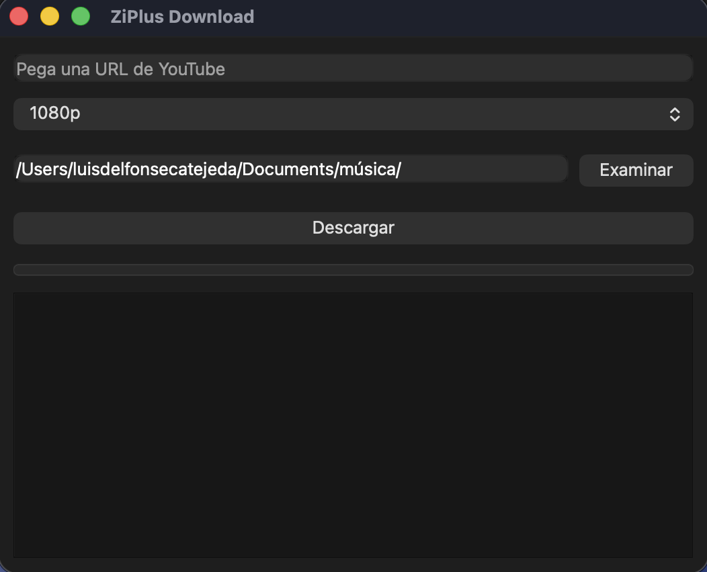

# ZiPlus Download

Aplicación de escritorio desarrollada en C++ y Qt para descargar videos y audio desde YouTube utilizando yt-dlp.

## Características

* Descarga videos de YouTube.
* Conversión directa a MP3.
* Selección de calidad:

    * 1080p
    * 720p
    * 480p
    * MP3
* Barra de progreso en tiempo real.
* Registro de eventos y errores.
* Selección de carpeta de destino.
* Persistencia de la carpeta de descarga mediante QSettings.
* Interfaz gráfica desarrollada completamente con Qt Widgets.

---

## Tecnologías utilizadas

* C++17
* Qt 6
* CMake
* yt-dlp
* FFmpeg

---

## Capturas

Agregar aquí capturas de pantalla de la aplicación.

```md

```

---

## Requisitos

### Dependencias externas

ZiPlus Download utiliza herramientas externas para realizar las descargas:

* yt-dlp
* FFmpeg

### macOS

Instalar mediante Homebrew:

```bash
brew install yt-dlp
brew install ffmpeg
```

Verificar instalación:

```bash
yt-dlp --version
ffmpeg -version
```

---

## Compilación

### Clonar repositorio

```bash
git clone https://github.com/usuario/ziplus-download.git
cd ziplus-download
```

### Crear carpeta de build

```bash
mkdir build
cd build
```

### Configurar proyecto

```bash
cmake ..
```

### Compilar

```bash
cmake --build .
```

---

## Estructura del proyecto

```txt
ZiPlusDownload/
│
├── src/
│   ├── MainWindow.cpp
│   ├── MainWindow.h
│   └── main.cpp
│
├── CMakeLists.txt
│
└── README.md
```

---

## Arquitectura

La aplicación está compuesta por una única ventana principal que administra toda la interfaz gráfica y la ejecución de yt-dlp.

### main.cpp

Punto de entrada de la aplicación.

Responsabilidades:

* Inicializar QApplication.
* Crear MainWindow.
* Mostrar la ventana principal.
* Iniciar el event loop de Qt.

---

### MainWindow

La clase MainWindow concentra toda la lógica de la aplicación.

Responsabilidades:

* Construcción de la interfaz.
* Selección de carpeta.
* Configuración de calidad.
* Lanzamiento de procesos externos.
* Lectura de progreso.
* Visualización de logs.

---

## Interfaz de usuario

La interfaz contiene:

### Campo URL

Permite introducir el enlace del video de YouTube.

### Selector de calidad

Opciones disponibles:

| Calidad | Descripción         |
| ------- | ------------------- |
| 1080p   | Video Full HD       |
| 720p    | Video HD            |
| 480p    | Calidad estándar    |
| MP3     | Extracción de audio |

### Carpeta de descarga

Permite seleccionar dónde se guardarán los archivos descargados.

### Barra de progreso

Muestra el porcentaje de descarga obtenido desde la salida estándar de yt-dlp.

### Consola de eventos

Visualiza:

* Progreso de descarga.
* Información generada por yt-dlp.
* Errores producidos durante la descarga.

---

## Funcionamiento interno

### Ejecución de yt-dlp

La aplicación utiliza QProcess para ejecutar yt-dlp como proceso externo.

Ejemplo conceptual:

```cpp
process->start(ytDlpPath, arguments);
```

---

### Lectura de progreso

La salida estándar de yt-dlp se captura en tiempo real.

Posteriormente se utiliza una expresión regular para extraer el porcentaje:

```cpp
(\d+\.\d+)%
```

Ejemplo:

```txt
[download] 42.3%
```

El valor obtenido se actualiza automáticamente en la barra de progreso.

---

### Descarga de audio

Cuando se selecciona MP3 se ejecutan parámetros específicos:

```bash
-x
--audio-format mp3
--audio-quality 0
--embed-thumbnail
--add-metadata
```

Características:

* Conversión automática a MP3.
* Inclusión de miniatura.
* Inclusión de metadatos.

---

### Descarga de video

Para video se utilizan filtros de formato dependiendo de la calidad seleccionada.

Ejemplo para 1080p:

```bash
bestvideo[height<=1080]+bestaudio/best[height<=1080]
```

Posteriormente FFmpeg realiza la unión de audio y video:

```bash
--merge-output-format mp4
```

---

## Configuración persistente

La carpeta de descarga se almacena utilizando QSettings.

Organización:

```txt
Empresa: ZiPlus
Aplicación: ZiPlusDownload
```

Esto permite que la carpeta seleccionada permanezca disponible entre ejecuciones.

---

## Limitaciones actuales

* Solo soporta URLs individuales.
* No soporta playlists.
* No permite pausar descargas.
* No permite cancelar descargas.
* No detecta automáticamente la ubicación de yt-dlp.
* No incluye FFmpeg dentro de la distribución.

---

## Roadmap

Características planeadas:

* [ ] Descarga de playlists.
* [ ] Descarga múltiple.
* [ ] Cola de descargas.
* [ ] Cancelación de descargas.
* [ ] Historial.
* [ ] Temas claro/oscuro.
* [ ] Actualización automática de yt-dlp.
* [ ] Empaquetado para Windows.
* [ ] Empaquetado para macOS.
* [ ] Empaquetado para Linux.

---

## Licencia

MIT License

---

## Autor

Desarrollado por QuarticCode.
